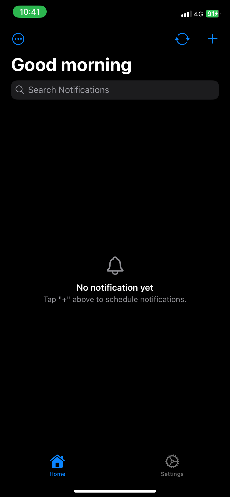
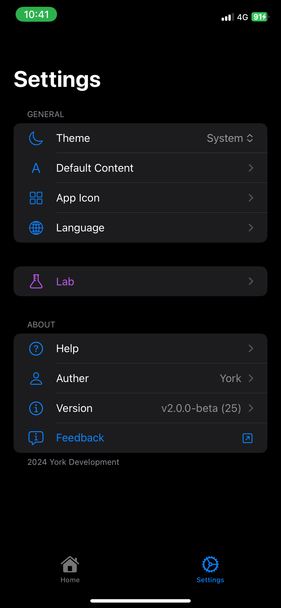

<p align="center">
  <a href="#" target="_blank">
    
  </a>
  <a href="#" target="_blank">
    
  </a>
</p>

<p align="center"> 
  <a href="README.md">English</a> 
  ·
  <a href="README_TW.md">繁體中文</a> 
</p>

<table>
  <tr>
    <td></td>
    <td></td>
  </tr>
</table>

- Schedule notifications and send them at specified times
- Beautiful interface made using SwiftUI
- Completely free, open source

> [!NOTE]  
> This application is not on the App Store because the developer cannot afford the Apple Developer Program membership fee. You need to install it on your device using Xcode. You are also welcome to sponsor developers through the Buy Me a Coffee button below, thank you!

# installation

This guide will help you import this project into Xcode and run it on your iPhone or iOS simulator.

## Table of Contents

- [Prerequisites](#prerequisites)
- [Steps to Import and Run the Project in Xcode](#steps-to-import-and-run-the-project-in-xcode)
  - [1. Clone the Repository](#1-clone-the-repository)
  - [2. Open the Project in Xcode](#2-open-the-project-in-xcode)
  - [3. Set Up Signing & Capabilities](#3-set-up-signing--capabilities)
  - [4. Choose Your Target Device](#4-choose-your-target-device)
  - [5. Build and Run the App](#5-build-and-run-the-app)
- [Troubleshooting](#troubleshooting)
- [Bug report / Feedback](#bug-report--feedback)
- [Contribution](#contribution)
- [License](#license)
- [Support](#support)

## Prerequisites

Before you begin, ensure that you have the following:

- **A Computer** with macOS.
- **Xcode** installed (requires macOS 13 or higher to support development for iOS 15 and above). You can download Xcode from the [App Store](https://apps.apple.com/us/app/xcode/id497799835).
- **iPhone/iPad** (physical device or simulator) requires iOS 15 or higher. If it is a physical machine, please enable "Developer Mode" first.
- **Apple Developer Account** (free or paid) for code signing and device testing.

## Steps to Import and Run the Project in Xcode

### 1. Clone the Repository

- You can download the project as a ZIP file from the GitHub repository and extract it to your desired location.

- Alternatively, clone the project repository to your local machine using Git:

```bash
git clone https://github.com/york9675/YorkNotify.git
```

### 2. Open the Project in Xcode

1. **Open Xcode**.
2. **Open the Project**: Navigate to the directory where you cloned/downloaded the project, then open the `YorkNotify/YorkNotify.xcodeproj`. (Please unzip `YorkNotify/YorkNotify.xcodeproj.zip` first)

### 3. Set Up Signing & Capabilities

1. **Select Your Team**:  
   - In Xcode, click on the project in the project navigator.
   - Go to the **Signing & Capabilities** tab.
   - Under the **Team** dropdown, select your Apple ID (if it’s not there, add your Apple ID under Xcode > Preferences > Accounts).
   - Ensure that **Automatically manage signing** is checked.

2. **Provisioning Profile**:  
   Xcode will automatically generate a provisioning profile for you, allowing you to run the app on your physical device.

### 4. Choose Your Target Device

1. In the top toolbar, select your target device (e.g., iPhone simulator or your connected iPhone) from the dropdown menu.
2. Ensure your device is connected via USB or select a simulator if you don’t have a physical device available.

### 5. Build and Run the App

1. **Build the Project**:  
   Click the **Run** button (the play icon) in the top-left corner of Xcode. Xcode will compile the code and build the app.
   
2. **Run the App**:  
   After the build is successful, Xcode will automatically install the app on the selected device or simulator.

3. **Trusting the Developer on iPhone (if required)**:  
   If you’re using a free developer account and testing on a physical iPhone, you may need to manually trust the app. Go to:
   - **Settings** > **General** > **VPN & Device Management** > **Your Apple ID** > **Trust**.

> [!WARNING]\
> If you're using a free Apple Developer account, the app's code signing is only valid for 7 days. After that period, the app will no longer launch, and you'll need to reinstall it by re-running the project in Xcode.

## Troubleshooting

- **Build Errors**: If you encounter build errors, check the build output in Xcode for clues on missing files, configurations, or dependencies.

## Bug report / Feedback

If you encounter any problems during use or have feedback, please fill out **[this form](https://forms.gle/o1hFjy4q98Ua1H7L7)** to report.

Alternatively, you can report back by creating issues.

## Contribution

Feel free to contribute to this project by creating issues, submitting pull requests, or improving documentation.

## License

This project is licensed under the MIT License. See the LICENSE file for more details.

## Support

Give a ⭐️ if you think this project is great!

<p><a href="https://www.buymeacoffee.com/york0524"> </a></p><br><br>

***

2024 York Development

Made in Taiwan using :heart: and Swift.