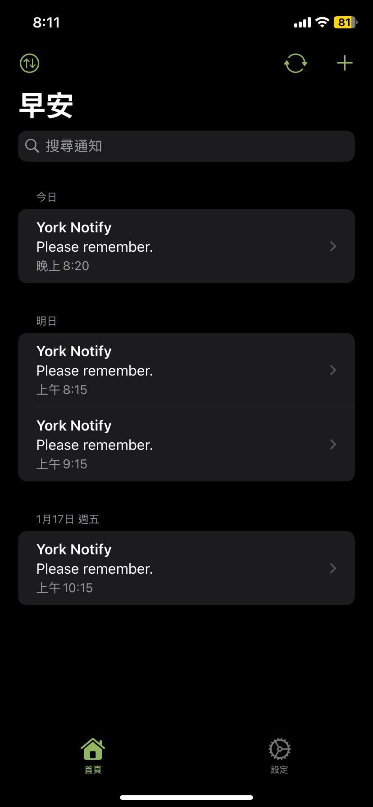
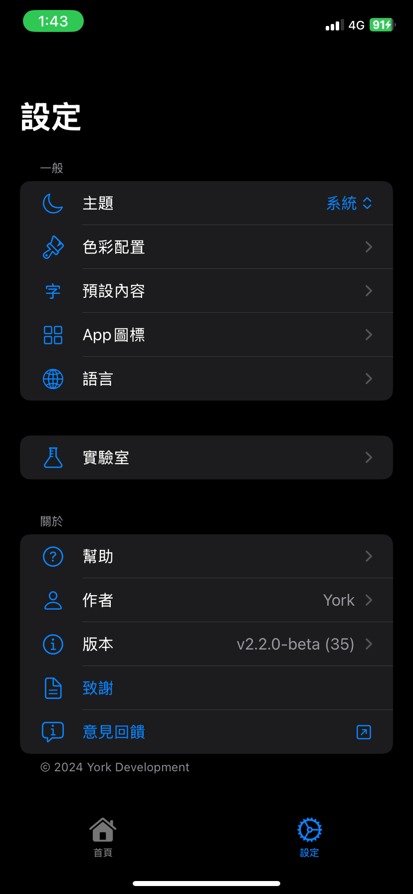

<p align="center">
  <a href="#" target="_blank">
    
  </a>
  <a href="#" target="_blank">
    
  </a>
</p>

<p align="center"> 
  <a href="README.md">English</a> 
  ·
  <a href="README_TW.md">繁體中文</a> 
</p>

<div align="center">
  <table>
    <tr>
      <td></td>
      <td></td>
    </tr>
  </table>
</div>

- 排程通知並在指定時間傳送
- 使用SwiftUI製成的精美介面
- 易使用
- 完全免費開源且超實用

> [!NOTE]  
> 此應用程式由於開發者無法負擔那個貴死人的蘋果開發者計劃會費，因此未上架App Store，需要自行使用Xcode安裝到您的裝置上。歡迎透過下方Buy Me a Coffee按鈕贊助開發者，感謝！

# 安裝

本指南將幫助您將此專案匯入 Xcode 並將此程式在 iPhone 或 iOS 模擬器上執行。

## 目錄

- [備料](#備料)
- [在 Xcode 中匯入並執行專案的步驟](#在-xcode-中匯入並執行專案的步驟)
  - [1. 複製儲存庫](#1-複製儲存庫)
  - [2. 在 Xcode 中開啟項目](#2-在-xcode-中開啟項目)
  - [3. 設定簽名和功能](#3-設定簽名和功能)
  - [4. 選擇您的目標設備](#4-選擇您的目標設備)
  - [5. 建置並運行應用程式](#5-建置並運行應用程式)
- [故障排除](#故障排除)
- [問題回報 / 意見回饋](#問題回報--意見回饋)
- [貢獻](#貢獻)
- [許可證](#許可證)
- [贊助](#贊助)

## 備料

在開始之前，請確保您具備以下條件：

- **一台裝有 macOS 的電腦**。
- **Xcode** (需要macOS 13 或更高版本以支援iOS 16以上的開發) 您可以從 [App Store](https://apps.apple.com/us/app/xcode/id497799835) 下載 Xcode。
- **iPhone/iPad** (實體機或模擬機) 需要 iOS 16 或更高版本。如是實體機，請先開啟「開發者模式」。
- **Apple 開發者帳戶** (免費或付費) 用於程式碼簽署和裝置測試。

## 在 Xcode 中匯入並執行專案的步驟

### 1.複製儲存庫

- 您可以從 GitHub 儲存庫下載 ZIP 檔案形式的項目，並將其解壓縮到您所需的位置。

- 或者，使用 Git 將專案儲存庫複製到本機：

````bash
git clone https://github.com/york9675/YorkNotify.git
````

### 2. 在 Xcode 中開啟項目

1. **打開 Xcode**。
2. **開啟專案**：導覽至複製/下載專案的目錄，然後開啟 `YorkNotify/YorkNotify.xcodeproj`。

### 3. 設定簽名和功能

1. **選擇您的Team**：
 - 在 Xcode 中，按一下專案導覽器中的項目。
 - 前往 **Signing & Capabilities**。
 - 在 **Team** 下拉清單中，選擇您的 Apple ID（如果不存在，請在 Xcode > Preferences > Accounts 新增您的Apple ID）。
 - 確保勾選 **Automatically manage signing**。

2. **設定檔**：
 Xcode 將自動為您產生設定文件，讓您在設備上執行該應用程式。

### 4. 選擇您的目標設備

1. 在頂部工具列中，從下拉式選單中選擇您的目標裝置。
2. 確保您的裝置已透過 USB 或 Wi-Fi 連接，或者如果您沒有可用的實體設備，請選擇模擬器。

### 5. 建置並運行應用程式

1. **建置專案**：
 點選 Xcode 左上角的 **Run** 按鈕（播放圖示）。 Xcode 將編譯程式碼並建立應用程式。

2. **執行應用程式**：
 建置成功後，Xcode會自動將應用程式安裝到所選裝置或模擬器上。

3. **信任 iPhone 上的開發者（如果需要）**：
 如果您使用免費的開發者帳戶並在實體 iPhone 上進行測試，則可能需要手動信任該應用程式。前往：
 - **設定** > **一般** > **VPN與裝置管理** > **您的 Apple ID** > **信任**。

> [!WARNING]\
> 如果您使用免費的 Apple 開發者帳戶，應用程式的簽名有效期僅為 7 天。在此期限之後，應用程式將不能再使用，您需要透過在 Xcode 中重新執行專案來重新安裝它。

## 故障排除

- **建置錯誤**：如果遇到建置錯誤，請檢查 Xcode 中的建置輸出，以取得有關遺失檔案、配置或相依性的線索。

## 問題回報 / 意見回饋

如在使用上遇到任何問題或是有意見回饋，請填寫 **[此表單](https://forms.gle/o1hFjy4q98Ua1H7L7)** 來回報。

或者，您也可以透過創建Issues來回報。

## 貢獻

請透過建立Issues、提交Pull Request或改進檔案來為該專案做出貢獻。

## 許可證

該項目已獲得 MIT 許可證的許可。有關更多詳細信息，請參閱許可證文件。

## 贊助

當我開始開發應用程式時，我的目標很簡單但真誠：創造一些真正有幫助的東西，並且免費提供。在這個充斥著付費功能和廣告的世界中，我希望能夠建立一些任何人都能免費使用的工具，純粹是為了讓生活變得更方便。我的應用程式一直是無廣告的，有些甚至是開源的（像目前的這個專案）。我始終相信，即使我的應用程式只能幫助到一小部分人，讓他們的生活更容易或更高效，那也已經值得了。

然而，在這個過程中我遇到了一些財務上的挑戰。我的理想與身為獨立開發者的現實之間存在明顯的差距。儘管我擁有繼續開發的熱情與技術，但卻因為無法支付加入 Apple Developer Program 的費用而受到了限制。這個會員資格是必須的，它能讓我使用一些必要的功能，例如「時間敏感通知」，並且能讓應用程式上架於 App Store。每年 99 美元的費用，對於目前身為學生且使用 Hackintosh （因為我負擔不起一台真正的 Mac）開發的我來說，實在無力承擔。

沒有這個會員資格，我無法實現我對應用程式的完整構想，也無法通過 App Store 將應用程式廣泛地提供給 iOS 使用者。如果你曾從我的應用程式中受益，並感覺它們讓你的生活稍微方便了一些，我會非常感激你的支持。即使只是請我喝一杯咖啡，也能幫助我支付 Apple Developer Program 的費用，從而讓我能解鎖應用程式的全部潛力，並將它們分享給更多的人。

你的支持，不論多小，對我來說都意義非凡。這不僅僅是為了一個應用程式籌資，而是支持一種信念：科技可以是簡單、實用且免費的。感謝你與我一同堅持這個願景，幫助它繼續前行。

<p><a href="https://www.buymeacoffee.com/york0524"> </a></p><br>
  
或者您也可以簡單的給顆 :star: ！

## 星星歷史

[](https://star-history.com/#york9675/YorkNotify&Date)

***

© 2024 York Development

使用 :heart: 及 Swift 在台灣製作！